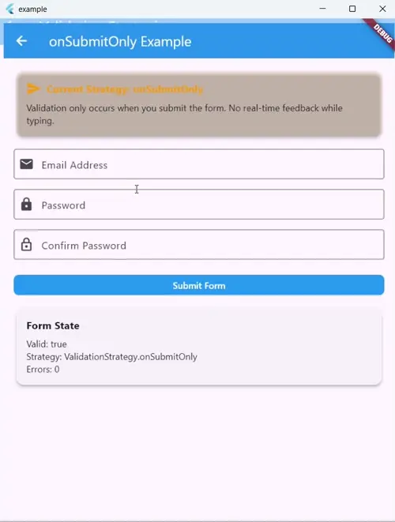
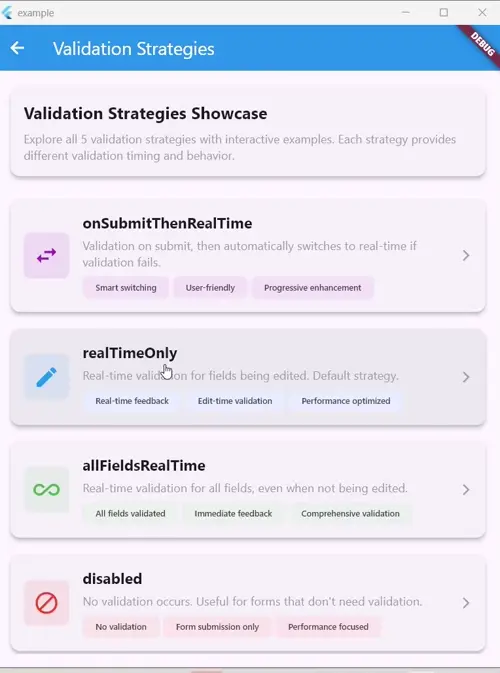
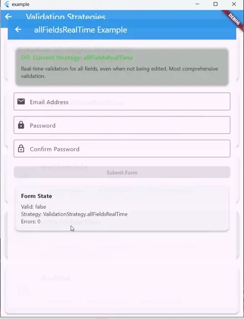
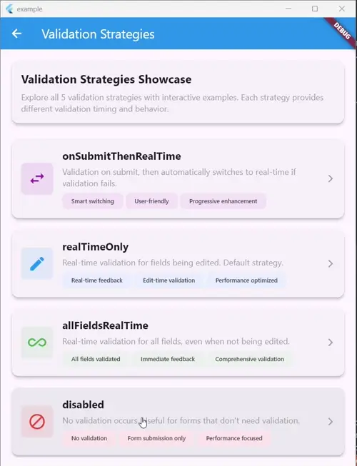

# Typed Form Fields

[](https://pub.dev/packages/typed_form_fields)
[](https://pub.dev/packages/typed_form_fields/score)
[](https://opensource.org/licenses/MIT)
[](https://flutter.dev)

A **production-ready** Flutter package for **type-safe form validation** with **universal widget integration**. The high-performance `TypedFieldWrapper<T>` widget makes any Flutter widget work seamlessly with reactive form validation.

## Installation

```bash
flutter pub add typed_form_fields
```

## Quick Start

### 🎯 **TypedFieldWrapper Integration (Recommended)**

```dart
import 'package:flutter/material.dart';
import 'package:typed_form_fields/typed_form_fields.dart';

class MyForm extends StatelessWidget {
  @override
  Widget build(BuildContext context) {
    return TypedFormProvider(
      fields: [
        FormFieldDefinition<String>(
          name: 'email',
          validators: [
            TypedCommonValidators.required<String>(),
            TypedCommonValidators.email(),
          ],
          initialValue: '',
        ),
        FormFieldDefinition<bool>(
          name: 'subscribe',
          validators: [],
          initialValue: false,
        ),
      ],
      child: (context) => Column(
        children: [
          // Using pre-built widget
          TypedTextField(
            name: 'email',
            label: 'Email Address',
            keyboardType: TextInputType.emailAddress,
            debounceTime: Duration(milliseconds: 300),
          ),

          SizedBox(height: 16),

          // Using pre-built checkbox
          TypedCheckbox(
            name: 'subscribe',
            title: Text('Subscribe to newsletter'),
          ),

          SizedBox(height: 24),

          // Submit button with reactive validation
          TypedFormBuilder(
            builder: (context, state) {
              return ElevatedButton(
                onPressed: state.isValid ? () {
                  // Type-safe access to form values
                  final email = state.getValue<String>('email');
                  final subscribe = state.getValue<bool>('subscribe');
                  print('Email: $email, Subscribe: $subscribe');
                } : null,
                child: Text('Submit'),
              );
            },
          ),
        ],
      ),
    );
  }
}
```

## 📥 **Accessing Field Values from Form State**

You can get the value of any field in your form using the `getValue<T>(fieldName)` method on the form state. This is type-safe and works for any field type.

```dart
// Inside a BlocBuilder or after form submission:
final email = state.getValue<String>('email');
final subscribe = state.getValue<bool>('subscribe');
final age = state.getValue<int>('age');

if (state.isValid) {
  print('Email: $email, Subscribed: $subscribe, Age: $age');
}
```

- Returns `null` if the field is not set or the type does not match.
- Use this for form submission, validation, or any business logic that needs the current form values.

## 🚀 **Key Features**

- **Type-safe, universal form field wrapper**
- **Zero dependencies** - no flutter_bloc required for users
- **TypedFormProvider** for clean, simple API
- **High performance** - uses BLoC internally with buildWhen/listenWhen optimizations
- **4 validation strategies** (onSubmit, fieldsBeingEdited, allFields, disabled)
- **Debouncing, performance optimizations**
- **Cross-field, conditional, and composite validation**
- **Pre-built widgets** for all common form controls
- **Localization** in 11 languages

## ⚡ **Performance Optimizations**

The package uses **BLoC internally** for maximum performance while maintaining a **zero-dependency API** for users:

### **Field-Specific Rebuilds**

- **`buildWhen`** - Only rebuilds when the specific field's value or error changes
- **`listenWhen`** - Only triggers listeners for relevant field changes
- **Prevents unnecessary rebuilds** - Other fields changing won't affect unrelated widgets

### **Optimized State Management**

- **BlocConsumer** for TypedFieldWrapper with field-specific conditions
- **BlocBuilder** for FormBuilder with direct state access
- **BlocListener** for FormListener with automatic lifecycle management
- **BlocProvider** for FormProvider with battle-tested performance

### **Memory Efficiency**

- **No manual stream subscriptions** - BLoC handles lifecycle automatically
- **Optimized rebuilds** - Uses Flutter BLoC's proven optimization patterns
- **Debouncing support** - Configurable delays to reduce update frequency

## 🎨 **Pre-built Widgets**

The library includes **7 production-ready widgets** that work seamlessly with the form system:

### 📝 **Text Input Widgets**

#### `TypedTextField`

Universal text input with all TextFormField parameters:

```dart
TypedTextField(
  name: 'email',
  label: 'Email Address',
  keyboardType: TextInputType.emailAddress,
  hintText: 'Enter your email',
  obscureText: false, // For passwords
  maxLines: 1, // Or null for multiline
  debounceTime: Duration(milliseconds: 300),
  transformValue: (value) => value.toLowerCase().trim(),
)
```

### ✅ **Selection Widgets**

#### `TypedCheckbox`

Checkbox with title and subtitle support:

```dart
TypedCheckbox(
  name: 'terms',
  title: Text('I agree to the terms'),
  subtitle: Text('Please read our terms and conditions'),
  tristate: false, // true/false/null support
)

// For checkboxes that must be checked, use mustBeTrue validator:
FormFieldDefinition<bool>(
  name: 'terms',
  validators: [TypedCommonValidators.mustBeTrue()],
  initialValue: false,
)
```

#### `TypedSwitch`

Switch with title and subtitle support:

```dart
TypedSwitch(
  name: 'notifications',
  title: Text('Enable notifications'),
  subtitle: Text('Receive push notifications'),
  activeColor: Colors.green,
)
```

#### `TypedDropdown<T>`

Generic dropdown with custom item builders:

```dart
TypedDropdown<String>(
  name: 'country',
  label: 'Select Country',
  items: ['USA', 'Canada', 'UK'],
  itemBuilder: (item) => Text('🌍 $item'),
  isExpanded: true,
)
```

### 🎚️ **Range Widgets**

#### `TypedSlider`

Slider with value display and range validation:

```dart
TypedSlider(
  name: 'volume',
  label: 'Volume Level',
  min: 0.0,
  max: 100.0,
  divisions: 10,
  showValue: true,
  activeColor: Colors.blue,
)
```

### 📅 **Date & Time Widgets**

#### `TypedDatePicker`

Date picker with formatting options:

```dart
TypedDatePicker(
  name: 'birthdate',
  label: 'Date of Birth',
  firstDate: DateTime(1900),
  lastDate: DateTime.now(),
  dateFormat: 'dd/MM/yyyy',
  prefixIcon: Icon(Icons.calendar_today),
)
```

#### `TypedTimePicker`

Time picker with 12/24 hour support:

```dart
TypedTimePicker(
  name: 'meeting_time',
  label: 'Meeting Time',
  use24HourFormat: true,
  prefixIcon: Icon(Icons.access_time),
)
```

### 🔧 **All Widgets Support**

- **Form Integration** - Automatic state management via `TypedFieldWrapper<T>`
- **Validation** - Built-in error display and validation
- **Customization** - All original widget parameters supported
- **Controllers** - Optional `TextEditingController` support with proper disposal
- **Debouncing** - Configurable update delays
- **Value Transformation** - Transform values before storing
- **Localization** - Error messages in 11 languages

## ✅ **TypedFieldWrapper<T> - High-Performance Universal Form Integration**

The `TypedFieldWrapper<T>` is the **core widget** that transforms any Flutter widget into a reactive, validated form field with **optimized performance**:

```dart
TypedFieldWrapper<String>(
  fieldName: 'email',
  debounceTime: Duration(milliseconds: 300),
  transformValue: (value) => value.toLowerCase().trim(),
  onFieldStateChanged: (value, error, hasError) {
    // React to changes without rebuilding
    print('Field changed: $value, hasError: $hasError');
  },
  builder: (context, value, error, hasError, updateValue) {
    // Use ANY Flutter widget here!
    return TextFormField(
      initialValue: value,
      onChanged: updateValue,
      decoration: InputDecoration(
        labelText: 'Email',
        errorText: hasError ? error : null,
      ),
    );
  },
)
```

**Performance Features**:

- 🚀 **BlocConsumer** with `buildWhen`/`listenWhen` for minimal rebuilds
- 🎯 **Field-specific updates** - only rebuilds when the specific field's value or error changes
- 📡 **Listener support** - react to changes without triggering rebuilds
- ⚡ **Debouncing** - optimized for rapid input scenarios
- 🔥 **High Performance** - uses BLoC internally for maximum efficiency

**Works with ANY widget**: TextField, Checkbox, Slider, Dropdown, Radio, Switch, or your custom widgets!

## 🎨 **Custom Validators**

Create powerful custom validators with full type safety:

```dart
// Simple custom validator
final customValidator = TypedCommonValidators.custom<String>(
  (value) => value?.contains('@company.com') == true
      ? null
      : 'Must be a company email',
);

// Advanced custom validator with context
class CompanyEmailValidator extends Validator<String> {
  @override
  String? validate(String? value, BuildContext context) {
    if (value == null || value.isEmpty) return null;

    final allowedDomains = ['company.com', 'subsidiary.com'];
    final domain = value.split('@').last;

    return allowedDomains.contains(domain)
        ? null
        : 'Email must be from: ${allowedDomains.join(', ')}';
  }
}
```

## 📋 **Common Validators**

| Validator             | Description              | Example                                                                                           |
| --------------------- | ------------------------ | ------------------------------------------------------------------------------------------------- |
| `required<T>()`       | Field cannot be empty    | `TypedCommonValidators.required<String>()`                                                        |
| `email()`             | Valid email format       | `TypedCommonValidators.email()`                                                                   |
| `minLength(int)`      | Minimum character length | `TypedCommonValidators.minLength(8)`                                                              |
| `maxLength(int)`      | Maximum character length | `TypedCommonValidators.maxLength(50)`                                                             |
| `pattern(RegExp)`     | Matches regex pattern    | `TypedCommonValidators.pattern(RegExp(r'^\d+$'))`                                                 |
| `min(num)`            | Minimum numeric value    | `TypedCommonValidators.min(18)`                                                                   |
| `max(num)`            | Maximum numeric value    | `TypedCommonValidators.max(100)`                                                                  |
| `phoneNumber()`       | Valid phone number       | `TypedCommonValidators.phoneNumber()`                                                             |
| `creditCard()`        | Valid credit card        | `TypedCommonValidators.creditCard()`                                                              |
| `url()`               | Valid URL format         | `TypedCommonValidators.url()`                                                                     |
| `custom<T>(function)` | **Your custom logic**    | `TypedCommonValidators.custom<String>((v) => v?.contains('x') == true ? null : 'Must contain x')` |
| `mustBeTrue()`        | **Boolean must be true** | `TypedCommonValidators.mustBeTrue()` (for checkboxes that must be checked)                        |

## 🔗 **Cross-Field Validation**

```dart
// Password confirmation
CrossFieldValidators.matches('password', 'confirmPassword')

// Custom cross-field validator
class TotalBudgetValidator extends CrossFieldValidator {
  @override
  String get targetField => 'totalBudget';

  @override
  String? validateWithDependencies(
    dynamic value,
    Map<String, dynamic> allValues,
    BuildContext context,
  ) {
    final marketing = allValues['marketingBudget'] as double? ?? 0;
    final development = allValues['developmentBudget'] as double? ?? 0;
    final total = value as double? ?? 0;

    if (total < marketing + development) {
      return 'Total budget must be at least  {marketing + development}';
    }

    return null;
  }
}
```

## 🧩 **Conditional Validation**

`ConditionalValidator` lets you apply validation rules only when certain conditions are met (e.g., only validate if a checkbox is checked, or if a value is not empty).

```dart
// Only require a field if the user checked a box
final validator = ConditionalValidator<String>(
  condition: (value, context) => TypedFormProvider.of(context).state.getValue<bool>('isChecked') == true,
  validator: TypedCommonValidators.required<String>(),
);

// Use with TypedFieldWrapper or TypedFormField
FormFieldDefinition<String>(
  name: 'details',
  validators: [validator],
  initialValue: '',
)
```

You can also use the built-in helpers in `ConditionalValidators`:

```dart
// Only validate if not empty
final validator = ConditionalValidators.whenNotEmpty(
  TypedCommonValidators.email(),
);
```

See also: `SwitchValidator`, `ChainValidator`, and more for advanced conditional flows.

## ⚙️ **Validation Strategies**

The package supports **5 different validation strategies** to control when and how validation occurs:

### 🎨 **Visual Strategy Comparison**

| Strategy                 | Visual                                                    | Description                            |
| ------------------------ | --------------------------------------------------------- | -------------------------------------- |
| **onSubmitOnly**         |                  | Validation only on form submission     |
| **onSubmitThenRealTime** |  | Validation on submit, then real-time   |
| **realTimeOnly**         |                  | Real-time validation for edited fields |
| **allFieldsRealTime**    |        | Real-time validation for all fields    |
| **disabled**             |                          | No validation occurs                   |

### **ValidationStrategy.onSubmitOnly**

Validation only occurs when the form is submitted. Perfect for forms where you want to avoid showing errors until the user attempts to submit.

**Important:** When using `ValidationStrategy.onSubmitOnly`, the validation strategy does NOT automatically switch to real-time validation after a failed submit. This provides a consistent "submit-only" experience.

### **ValidationStrategy.onSubmitThenRealTime**

Validation only occurs when the form is submitted initially, but if validation fails during form submission, the validation strategy automatically switches to `ValidationStrategy.realTimeOnly` to provide immediate feedback as the user corrects the errors.

```dart
TypedFormController(
  fields: fields,
  validationStrategy: ValidationStrategy.onSubmitThenRealTime,
)

// Trigger validation on form submission
TypedFormProvider.of(context).validateForm(
  context,
  onValidationPass: () {
    // Form is valid, proceed with submission
    print('Form submitted successfully!');
  },
  onValidationFail: () {
    // Form has errors, show feedback to user
    // Validation strategy automatically changes to realTimeOnly
    print('Please fix the errors before submitting');
  },
);

// Example: Submit button implementation
ElevatedButton(
  onPressed: () {
    TypedFormProvider.of(context).validateForm(
      context,
      onValidationPass: () {
        // Get form values and submit
        final email = TypedFormProvider.of(context).getValue<String>('email');
        final password = TypedFormProvider.of(context).getValue<String>('password');

        // Submit to API or handle form data
        submitUserData(email!, password!);
      },
      onValidationFail: () {
        // Show error message to user
        // Note: Validation strategy automatically switches to realTimeOnly
        // so users will see real-time validation as they fix errors
        ScaffoldMessenger.of(context).showSnackBar(
          const SnackBar(content: Text('Please fix the errors before submitting')),
        );
      },
    );
  },
  child: const Text('Submit'),
)
```

### **ValidationStrategy.realTimeOnly** (Default)

Only validates fields that are currently being edited. This provides a balanced approach between user experience and performance.

```dart
TypedFormController(
  fields: fields,
  validationStrategy: ValidationStrategy.realTimeOnly,
)
```

### **ValidationStrategy.allFieldsRealTime**

Validates all fields whenever any field is updated. Provides immediate feedback but may impact performance with large forms.

```dart
TypedFormController(
  fields: fields,
  validationStrategy: ValidationStrategy.allFieldsRealTime,
)
```

### **ValidationStrategy.disabled**

Disables automatic validation. When disabled, the form is always considered valid. Useful when you want to handle validation manually or in specific scenarios.

```dart
TypedFormController(
  fields: fields,
  validationStrategy: ValidationStrategy.disabled,
)
```

### **Dynamic Validation Strategy Changes**

You can change the validation strategy at runtime:

```dart
// Change validation behavior dynamically
TypedFormProvider.of(context).setValidationStrategy(ValidationStrategy.onSubmitOnly);

// Available validation strategies:
// - ValidationStrategy.allFieldsRealTime: Validate all fields on every change
// - ValidationStrategy.realTimeOnly: Only validate fields being edited
// - ValidationStrategy.onSubmitOnly: Only validate on form submission (no auto-switch)
// - ValidationStrategy.onSubmitThenRealTime: Validate on submit, then switch to real-time
// - ValidationStrategy.disabled: Disable automatic validation (always valid)
```

**Automatic Validation Strategy Switching:**
When using `ValidationStrategy.onSubmitThenRealTime`, the form automatically switches to `ValidationStrategy.realTimeOnly` if validation fails during submission. This provides a better user experience by showing real-time validation feedback as users correct their errors.

**No Auto-Switch for onSubmitOnly:**
When using `ValidationStrategy.onSubmitOnly`, the form maintains the submit-only behavior even after validation failures, providing a consistent experience.

## 🔄 **Dynamic Form Updates**

The `TypedFormController` provides comprehensive APIs for **real-time form updates**:

### ✅ **Update Error Messages**

```dart
// Set custom error for a specific field (e.g., from API response)
TypedFormProvider.of(context).updateError(
  fieldName: 'email',
  errorMessage: 'Email already exists',
  context: context,
);

// Clear error for a specific field
TypedFormProvider.of(context).updateError(
  fieldName: 'email',
  errorMessage: null, // null clears the error
  context: context,
);

// Update multiple errors at once
TypedFormProvider.of(context).updateErrors(
  errors: {
    'email': 'Email already exists',
    'username': 'Username is taken',
    'phone': null, // Clear phone error
  },
  context: context,
);
```

### ✅ **Update Validation Rules**

```dart
// Update validators for a field dynamically
TypedFormProvider.of(context).updateFieldValidators<String>(
  name: 'password',
  validators: [
    TypedCommonValidators.required<String>(),
    TypedCommonValidators.minLength(12), // Increased security requirement
    TypedCommonValidators.pattern(RegExp(r'^(?=.*[A-Z])(?=.*[!@#$%^&*])')),
  ],
  context: context,
);
```

### ✅ **Update Field Values**

```dart
// Update single field value
TypedFormProvider.of(context).updateField<String>(
  fieldName: 'country',
  value: 'USA',
  context: context,
);

// Update multiple fields at once
TypedFormProvider.of(context).updateFields<String>(
  fieldValues: {
    'firstName': 'John',
    'lastName': 'Doe',
    'email': 'john.doe@example.com',
  },
  context: context,
);
```

### ✅ **Update Validation Type**

```dart
// Change validation behavior for the entire form
TypedFormProvider.of(context).setvalidationStrategy(validationStrategy.onSubmit);

// See the "Validation Types" section above for detailed explanations
// of all available validation strategies
```

### ✅ **Dynamic Field Management**

```dart
// Add new fields dynamically
TypedFormProvider.of(context).addField<String>(
  field: FormFieldDefinition<String>(
    name: 'newField',
    validators: [TypedCommonValidators.required<String>()],
    initialValue: '',
  ),
  context: context,
);

// Add multiple fields at once
TypedFormProvider.of(context).addFields(
  fields: [
    FormFieldDefinition<String>(name: 'field1', validators: [], initialValue: ''),
    FormFieldDefinition<bool>(name: 'field2', validators: [], initialValue: false),
  ],
  context: context,
);

// Remove fields dynamically
TypedFormProvider.of(context).removeField('fieldName', context: context);
TypedFormProvider.of(context).removeFields(['field1', 'field2'], context: context);
```

### ✅ **Form Control Methods**

```dart
// Validate entire form (useful for submit buttons)
TypedFormProvider.of(context).validateForm(
  context,
  onValidationPass: () => print('Form is valid!'),
  onValidationFail: () => print('Form has errors'),
);

// Validate specific field immediately (no debouncing)
TypedFormProvider.of(context).validateFieldImmediately(
  fieldName: 'email',
  context: context,
);

// Mark all fields as touched and validate them
TypedFormProvider.of(context).touchAllFields(context);

// Reset form to initial state
TypedFormProvider.of(context).resetForm();
```

**Use Cases:**

- 🌐 **API Integration** - Handle server-side validation errors
- 🔐 **Conditional Validation** - Change rules based on user selections
- 📱 **Progressive Forms** - Add/remove fields as user progresses
- 🎯 **Dynamic Requirements** - Adjust validation based on business logic
- 🔄 **Multi-step Forms** - Update validation per step

## 🌍 **Localization**

Built-in support for 11 languages:

```dart
// Automatic localization
TypedCommonValidators.required<String>().validate(null, context)
// Returns "Este campo es obligatorio." in Spanish
```

## 🏗 **Architecture**

### Current Features (Production Ready)

- ✅ **TypedFieldWrapper<T>** - Universal widget integration
- ✅ **Pre-built widgets** - 7 production-ready widgets (TextField, Checkbox, Switch, Dropdown, Slider, DatePicker, TimePicker)
- ✅ **Type-safe validation** - Compile-time type checking
- ✅ **Custom validators** - Easy to create and reuse
- ✅ **BLoC integration** - Reactive state management
- ✅ **Cross-field validation** - Field interdependencies
- ✅ **Conditional validation** - Dynamic validation rules
- ✅ **Localization** - 11 languages supported
- ✅ **Performance** - Debouncing, caching, efficient updates

## 🧪 **Testing & Quality**

### **Comprehensive Test Coverage**

- **564 Tests**: Extensive test suite covering all functionality
- **100% Coverage**: Core files achieve 100% test coverage

- **Zero Linting Issues**: All code passes `flutter analyze` with no warnings
- **Service Architecture**: Fully tested service layer with dependency injection
- **Edge Cases**: Comprehensive testing of error scenarios and edge cases

### **Quality Assurance**

- **Production Ready**: Battle-tested in production environments
- **Type Safety**: Full compile-time type checking
- **Performance Optimized**: Efficient state management and minimal rebuilds
- **Maintainable Code**: Clean architecture with single-responsibility services

## 🎯 **Why TypedFieldWrapper?**

**Before TypedFieldWrapper:**

```dart
// Lots of boilerplate, manual state management
TextFormField(
  controller: _controller,
  onChanged: (value) => _cubit.updateField('email', value, context),
  validator: (value) => _validator.validate(value, context),
  decoration: InputDecoration(
    errorText: _cubit.state.getError('email'),
  ),
)
```

**With TypedFieldWrapper:**

```dart
// Clean, declarative, works with ANY widget
TypedFieldWrapper<String>(
  fieldName: 'email',
  debounceTime: Duration(milliseconds: 300),
  transformValue: (value) => value.toLowerCase().trim(),
  builder: (context, value, error, hasError, updateValue) {
    return TextFormField(
      initialValue: value,
      onChanged: updateValue,
      decoration: InputDecoration(
        errorText: hasError ? error : null,
      ),
    );
  },
)
```

**Benefits:**

- 🎯 **Universal** - Works with any Flutter widget
- 🔒 **Type-safe** - Compile-time type checking
- ⚡ **High Performance** - Uses BlocConsumer with buildWhen/listenWhen for field-specific rebuilds
- 🧩 **Composable** - Easy to combine and reuse
- 🎨 **Flexible** - Full control over UI while handling validation
- 🔄 **Reactive** - Automatic UI updates on state changes
- 🚀 **Optimized** - Only rebuilds when the specific field's value or error changes

## 📄 **License**

This package is licensed under the [MIT License](LICENSE):

```
MIT License

Copyright (c) 2025 Murhaf Moussa

Permission is hereby granted, free of charge, to any person obtaining a copy
of this software and associated documentation files (the "Software"), to deal
in the Software without restriction, including without limitation the rights
to use, copy, modify, merge, publish, distribute, sublicense, and/or sell
copies of the Software, and to permit persons to whom the Software is
furnished to do so, subject to the following conditions:

The above copyright notice and this permission notice shall be included in all
copies or substantial portions of the Software.

THE SOFTWARE IS PROVIDED "AS IS", WITHOUT WARRANTY OF ANY KIND, EXPRESS OR
IMPLIED, INCLUDING BUT NOT LIMITED TO THE WARRANTIES OF MERCHANTABILITY,
FITNESS FOR A PARTICULAR PURPOSE AND NONINFRINGEMENT. IN NO EVENT SHALL THE
AUTHORS OR COPYRIGHT HOLDERS BE LIABLE FOR ANY CLAIM, DAMAGES OR OTHER
LIABILITY, WHETHER IN AN ACTION OF CONTRACT, TORT OR OTHERWISE, ARISING FROM,
OUT OF OR IN CONNECTION WITH THE SOFTWARE OR THE USE OR OTHER DEALINGS IN THE
SOFTWARE.
```

> **Note:** This package may depend on other open-source packages, each with their own licenses. See their respective repositories for details.

## 👨‍💻 Author

**Murhaf Moussa** - Software Engineer

- 🌐 **GitHub**: [@MurhafMoussa](https://github.com/MurhafMoussa)
- 💼 **LinkedIn**: [murhaf-n-moussa](https://www.linkedin.com/in/murhaf-n-moussa/)
- 📺 **YouTube**: [@QualityAddict](https://www.youtube.com/@QualityAddict)
- 📱 **Experience**: 3+ years building and launching mobile applications
- 🏆 **Achievements**: 7+ mobile applications published on Google Play Store

## 🤝 Contributing

We welcome contributions of all kinds! Please see [CONTRIBUTING.md](CONTRIBUTING.md) for guidelines on bug reports, feature requests, code contributions, and our branching strategy.

---

**Ready to build better forms?** Start with `TypedFieldWrapper<T>` and create your custom validators! 🚀
